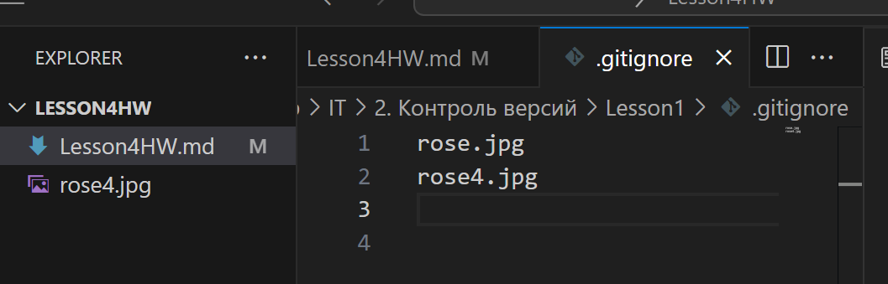

# Инструкция. 
## **Основные команды Git**

**НЕ забывать сохранять изменения! CTRL + S**

1. Инициализация локального репозитория
```sh
git init
```
2. Получить информацию от git о его текущем состоянии
```sh
git status
```
3. Добавить файл или файлы к следующему коммиту
```sh
git add
```
4. Создание коммита
```sh
git commit -m “message”
```
5. Вывод на экран истории всех коммитов с их хеш-кодами
```sh
git log
git log --oneline
```
5.1 Вывод на экран с графическим изображением имеющихся веток, истории их слияния
```sh
git log --oneline --graph
```

## Ветки

6. Посмотреть список веток в репозитории
```sh
git branch
```
7. Cоздать новую ветку
```sh
git branch <название ветки>
```
8. Переход к другой ветке
```sh
git checkout <название ветки> 
```
9. удалить ветку
```sh
git branch -d <название ветки> 
```
## Добавление рисунка
1. ! [название](имя файла)
*Важно! Рисунок должен быть созранен в репозитории*


2. Надо удалить рисунок  - через файл ".gitignore"
*Создаем или открываем уже имеющийся файл с таким названием. Вписываем туда название файла (рисунка)*


## Дополнительно на что обращаем внимание

* Удаляем "отработаные" ветви
* Для скорости можно не заводить заново команду, а переходить уже на ранее использованные стрелками
* допечатать название файла автоматически - кнопка "tab"
* Очистить историю команд - clear

НЕ забывать сохранять изменения! CTRL + S
